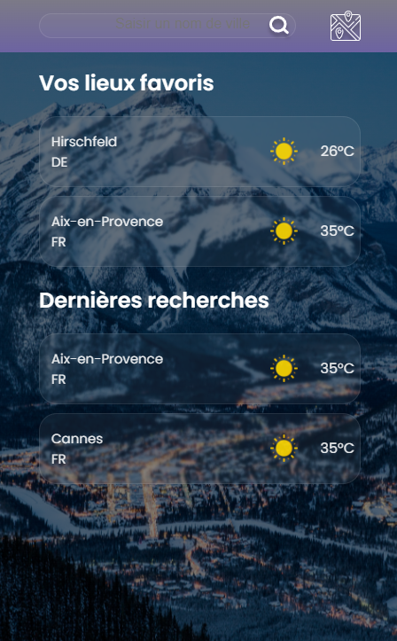

# Weather Roulette Europe - featuring OpenWeatherMap API

Bienvenue dans la documentation de l'application Weather Roulette Europe. 
:slightly_smiling_face:
Cette application vous permet de consulter les prévisions météorologiques pour les villes européennes de votre choix, ou du choix de l'appli !

Voici un aperçu rapide de ses fonctionnalités et de son utilisation.

- [Aperçu](#aperçu)
- [Fonctionnalités](#fonctionnalités)
- [Utilisation](#utilisation)
- [Installation](#installation)
- [Remerciements](#remerciements)

### Aperçu

L'application Météo offre une interface conviviale pour obtenir des informations météorologiques. 
Vous retrouvez en page page d'accueil vos favoris et vos dernières recherches. 

Vous pouvez saisir le nom d'une ville pour rechercher les prévisions météo actuelles ou cliquer sur la carte pour obtenir des prévisions d'une ville aléatoire.

### Fonctionnalités

Prévisions météorologiques actuelles pour une ville spécifique recherchée.
Recherche aléatoire parmi les villes des 44 pays d'Europe.
Accès aux prévisions des 5 prochains jours. 
Gestion des villes favorites pour un accès rapide aux prévisions.
Historique des dernières recherches saisies pour un suivi facile.

### Utilisation

Page d'accueil:
La page d'accueil présente vos éléments favoris et vos dernières recherches.
Vous pouvez cliquer sur une ville favorite pour afficher les prévisions météo actuelles.
Les prévisions aléatoires peuvent être obtenues en cliquant simplement sur la carte.

Recherche de ville:
Saisissez le nom d'une ville dans la barre de recherche et appuyez sur "Rechercher" pour obtenir les prévisions météo actuelles pour cette ville.

Gestion des favoris:
Depuis la vue sur les tendances météorologiques actuelles d'une ville, vous pouvez ajouter ou supprimer des villes de votre liste de favoris.
Une ville aléatoire vous inspire ? Ajoutez-la aux favoris en un clic. 

Historique des recherches:
L'historique des dernières recherches vous permet de voir rapidement les villes que vous avez saisies dans la barre de recherche.

Barre de navigation: 
La navbar se déploie à tout moment en présentant un bouton de retour à l'accueil. 

### Installation

1. Clonez ce référentiel sur votre machine locale.
2. Exécutez `npm install` pour installer les dépendances nécessaires.
3. Ouvrez le dossier dans votre éditeur de code.
4. Complétez les fichiers `param.js.skel` et `config.js.skel` avec votre clé d'API OpenWeatherMap.
5. Supprimez l'extension `.skel` des fichiers.
6. Accédez à l'application dans votre navigateur.

### Remerciements
Je remercie Cédric Rouby, <a href="https://github.com/Acksop?tab=stars">Emmanuel Roy</a>  et <a href="https://github.com/ohugonnot">Odilon Hugonnot</a>  pour leurs conseils et leur implication. 